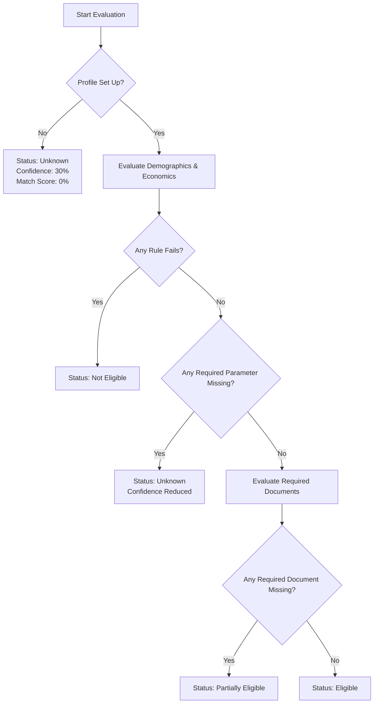

# Rule Engine Specification - Scheme Mate

This document outlines the architecture, evaluation rules, priority logic, and JSON schemas of the **Rule-Based Eligibility Engine** of **Scheme Mate — Find. Apply. Benefit.**

The engine is built to be config-driven, allowing new rules to be added to schemes without requiring database schema migrations.

---

## 🛠️ Supported Rule Keys and IDs

The engine maps database attributes to specific checks, each returning a structured payload:
`{ "ruleId": String, "passed": Boolean|null, "message": String }`

| Rule Key | Rule ID | Profile Property | Condition Evaluated | Mismatch / Error Message |
| :--- | :--- | :--- | :--- | :--- |
| `state` | `STATE` | `state` | `state === 'All India' \|\| profile.state === state` | Restricted to residents of `state`. |
| `minAge` | `AGE_MIN` | `dob` (Age) | `age >= minAge` | Minimum age required is `minAge` years. |
| `maxAge` | `AGE_MAX` | `dob` (Age) | `age <= maxAge` | Maximum age allowed is `maxAge` years. |
| `maxIncome` | `INCOME` | `annual_income` | `profile.annual_income <= maxIncome` | Income exceeds maximum allowed. |
| `gender` | `GENDER` | `gender` | `gender === 'All' \|\| profile.gender === gender` | Restricted to `gender` applicants. |
| `isStudent` | `STUDENT` | `is_student` | `profile.is_student === true` | User profile is not student. |
| `isFarmer` | `FARMER` | `is_farmer` | `profile.is_farmer === true` | User profile is not farmer. |
| `isBusinessOwner` | `BUSINESS` | `is_business_owner` | `profile.is_business_owner === true` | User profile is not business owner. |
| `category` | `CATEGORY` | `category` | `category.includes(profile.category)` | Restricted to categories: `category[]`. |
| `education` | `EDUCATION` | `education` | `education.includes(profile.education)` | Requires qualifications: `education[]`. |
| `disabilityStatus` | `DISABILITY` | `disability_status` | `profile.disability_status === true` | Requires disability credentials. |
| `minorityStatus` | `MINORITY` | `minority_status` | `profile.minority_status === true` | Requires minority credentials. |
| `[Doc Name]` | `DOC_[NAME]` | `documents` | `profile.documents[docName].exists === true` | Missing required document: `[Doc Name]`. |

---

## 🧭 Evaluation Priority & Status Resolution

The engine evaluates rules sequentially to determine matching states:



### Overall Status States:
1.  **Eligible:** All demographic/economic rules pass, no required fields are missing, and all required documents are checked off.
2.  **Partially Eligible:** All demographic/economic rules pass, but one or more required documents are missing in the user profile.
3.  **Unknown:** One or more parameters checked by the rules (e.g. Income, Category) are not filled out in the user profile, rendering the match outcome incomplete.
4.  **Not Eligible:** One or more demographic/economic rules (e.g. Age, State, Occupation) failed.

---

## 📈 Match Score & Confidence Formulas

### 1. Match Score (Percentage Match)
Represents how closely the user fits the scheme based on successful checks:
$$\text{Match Score} = \left( \frac{\text{Passed Rules Checked}}{\text{Total Rules Evaluated}} \right) \times 100$$
*(Note: A missing document counts as a failed check for the match score, but since demographic parameters passed, the match score will remain high, e.g. 90%, representing a Partial Match).*

### 2. Confidence Score
Controls the certainty of the match outcome. Missing parameters penalize confidence:
$$\text{Confidence Score} = \left( \frac{\text{Total Rules Checked} - \text{Missing Parameter Checks}}{\text{Total Rules Checked}} \right) \times 100$$
*(Note: If the user profile is null/empty, confidence defaults to 30%).*

---

## 📝 Example JSON eligibility_rules Configuration

```json
{
  "state": "Karnataka",
  "minAge": 18,
  "maxAge": 35,
  "maxIncome": 250000.0,
  "gender": "Female",
  "isStudent": true,
  "category": ["SC", "ST", "OBC"],
  "education": ["SSLC", "PUC", "Undergraduate"]
}
```
If this scheme is evaluated against a user who is 22 years old, resides in Karnataka, is a student, SC category, PUC education, but has an annual income of ₹3,00,000, the result will be:
- Status: **Not Eligible**
- Mismatch rule: `INCOME` (₹300,000 exceeds ₹250,000 limit)
- Match Score: **88%** (passed 7 out of 8 checks)
- Confidence: **100%** (all profile fields are set)
