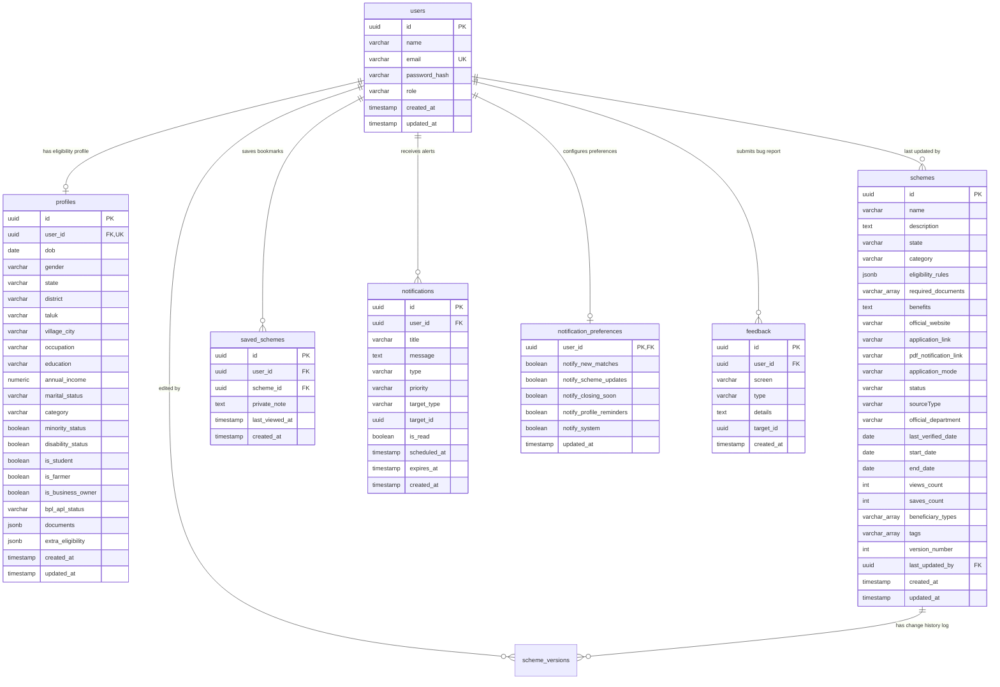

# Database Design - Scheme Mate

This document outlines the relational database schema, indexes, key constraints, and extensible JSONB structures of **Scheme Mate — Your Smart Government Benefits Assistant**.

---

## 🗺️ Entity Relationship Overview

---

## 1. Tables Specification

### A. `users` Table
Stores user account credentials.
* **id**: `UUID PRIMARY KEY DEFAULT gen_random_uuid()`
* **email**: `VARCHAR(255) UNIQUE` for authentication.
* **password_hash**: `VARCHAR(255)` hashed using bcryptjs.

### B. `profiles` Table
Stores user demographics and variables.
* **dob**: `DATE` (used to calculate age)
* **annual_income**: `NUMERIC(12, 2)` (precise exact values).
* **booleans**: `is_student`, `is_farmer`, `is_business_owner`, `disability_status`, `minority_status`.
* **documents**: `JSONB` checklist maps.

### C. `schemes` Table
Stores government benefit records.
* **eligibility_rules**: `JSONB` structured criteria mapping.
* **required_documents**: `VARCHAR(100)[]` checklist strings.

### D. `saved_schemes` Table
Stores bookmarks and private notes.
* **private_note**: `TEXT` optional user notes.

### E. `notifications` Table
Stores user alerts history records.
* **priority**: Low | Medium | High | Critical.
* **target_type**: scheme | profile | none.

### F. `feedback` Table
Stores bug reports and scheme corrections feedback.
* **type**: incorrect_scheme | bug | feature_request | missing_scheme.

---

## 2. Indexes and Optimization

1. **Email Lookup:** Unique B-Tree index on `users(email)`.
2. **Filtering Performance:** B-Tree indexes on `schemes(state)`, `schemes(category)`, and `schemes(status)`.
3. **Full-Text Search Index:** A GIN index on `schemes(name, description, benefits, department)`.
4. **Notifications Index:** B-Tree index on `notifications(user_id, is_read)` and `notifications(scheduled_at)`.
