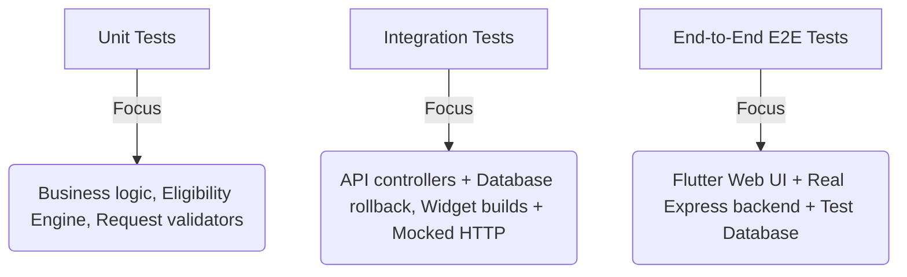

# Scheme Mate Testing Strategy & Guidelines

This document details the testing architecture, local execution commands, environment configurations, and CI pipelines for the **Scheme Mate** full-stack cross-platform ecosystem.

---

## 1. Testing Architecture

We divide our tests into three distinct layers to balance feedback speed with execution realism:



---

## 2. Express Backend Testing

> [!WARNING]
> **Test Database Safety Warning**
> Never point `DATABASE_URL_TEST` to your development or production database. Integration tests intentionally wipe tables and insert mock seeds during the test cycle.

### A. Environment Configuration Checklist
Create a local `.env.test` file or export the following variables in your shell environment:

| Variable | Required Value | Description |
| :--- | :--- | :--- |
| `DATABASE_URL_TEST` | `postgresql://...` | A completely separate test database connection string |
| `JWT_SECRET` | `test_jwt_secret_key_at_least_32_chars_long` | Signature secret for testing auth tokens |
| `NODE_ENV` | `test` | Switches Express error logging mode |
| `API_VERSION` | `1.0.0` | Injected version identifier header |

Initialize the database schema:
```bash
cd backend
npm run migrate
```

### B. Running Tests Locally vs CI

- **Run all tests (Local CLI)**:
   ```bash
   node --test --test-concurrency=1 tests/**/*.test.js
   ```
- **Run all tests (via NPM script)**:
   ```bash
   npm test
   ```
   *Note: Integration tests are executed sequentially (`--test-concurrency=1`) to prevent PostgreSQL transaction locks and deadlocks during concurrent table truncations.*

- **Run tests with coverage**:
   ```bash
   node --test --experimental-test-coverage tests/**/*.test.js
   ```

### C. Coverage Quality Goals for RC1
- Overall Backend Code: `≥80%`
- Eligibility Matching Engine: `≥95%`
- Request Validator Middlewares: `100%`
- Notification Dispatcher Service: `≥90%`

---

## 3. Flutter Frontend Testing

### A. Widget & Unit Tests
Widget tests execute locally on a headless test environment.
- Run tests:
  ```bash
  cd frontend
  flutter test
  ```

### B. Integration Tests (Mocked API)
Mocked integration tests use the `MockHttpClient` interceptor inside `integration_test/mock_api.dart` to simulate backend API responses without launching a real network server.
- Run integration tests:
  - **Windows Desktop**:
    ```bash
    flutter test -d windows integration_test/app_test.dart
    ```
  - **Chrome Web (Headless)**:
    ```bash
    flutter test -d chrome integration_test/app_test.dart
    ```

### C. Device-Backed End-to-End (E2E) Tests (Real API)
> [!NOTE]
> Device-backed integration tests use `flutter drive` (or the native Flutter integration workflow) while mocked widget integration tests can be executed with standard `flutter test`.

1. Start the backend in test mode:
   ```bash
   cd backend
   NODE_ENV=test npm start
   ```
2. Run the integration driver targeting your device/browser:
   ```bash
   cd frontend
   flutter drive --driver=test_driver/integration_test.dart --target=integration_test/app_test.dart -d chrome
   ```

---

## 4. CI/CD Workflows

We use **GitHub Actions** to automate pull request and push checks:

- **Fast Checks (Required before merge)**: Runs on every push/PR to block broken code:
  - **Backend**: Launches a PostgreSQL service container, runs database migrations from scratch to verify schema integrity, and runs `npm test`.
  - **Frontend**: Runs `flutter analyze`, `flutter test`, and builds the target packages (`flutter build web --release` and `flutter build apk --debug`) to prevent build regressions.
- **Nightly Checks (Non-blocking release validation)**: Runs on a schedule to execute slower device-framed integration tests and Lighthouse performance audits.

---

## 5. Troubleshooting Common Issues

### 1. PostgreSQL Deadlocks (`code: 40P01`)
- **Reason**: Test files are running in parallel and trying to execute table truncates concurrently.
- **Solution**: Enforce sequential test concurrency: `node --test --test-concurrency=1 tests/**/*.test.js`.

### 2. Missing SharedPreferences mock
- **Reason**: Flutter widget tests accessing disk storage throw missing initial values exceptions.
- **Solution**: Call `SharedPreferences.setMockInitialValues({});` before starting widget pumps.

### 3. Port Already in Use (`EADDRINUSE`)
- **Reason**: Another backend instance is already running on the same local port (usually `5000` or `8080`).
- **Solution**: Kill the existing node process or configure the server to use a different port in your environment: `PORT=5001 npm test`.

---

## 6. Future Testing Roadmap

For subsequent versions, we intend to implement:
- **Browser Automation**: Automated E2E web checks using Playwright or Selenium.
- **Visual Regression Testing**: Goldens and snapshot rendering checks on widgets.
- **API Contract Testing**: Verify Express routing alignment automatically using OpenAPI spec validators.
- **Load Testing**: Peak capacity measurements using k6 or Artillery.
